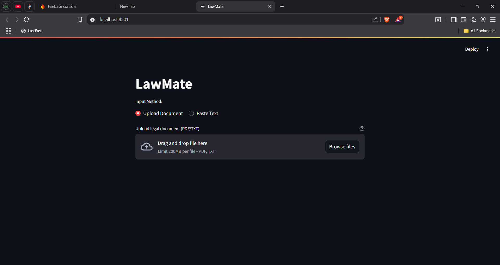
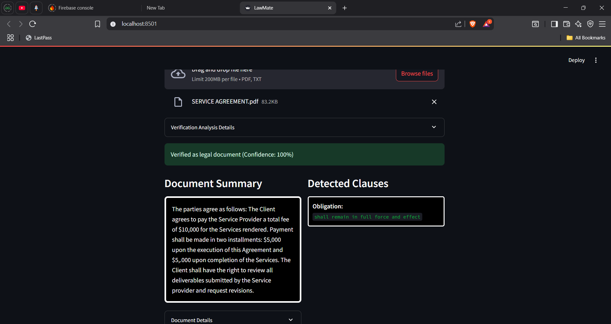
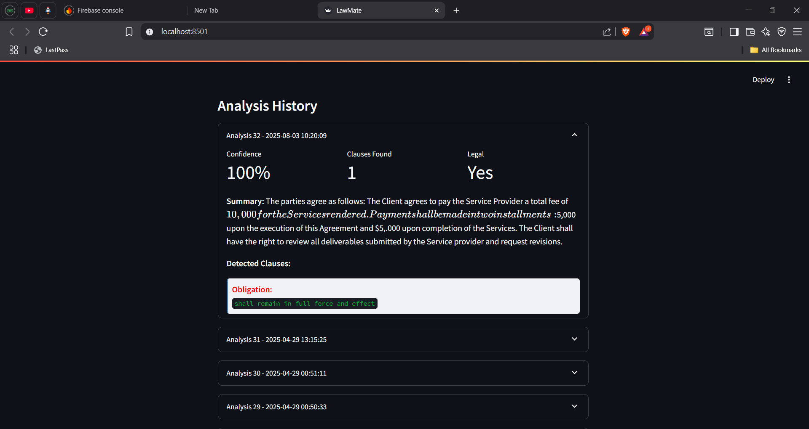

# LawMate ⚖️📄

This project is a Streamlit-based legal document analysis tool that uses NLP models, clause extraction patterns, and a local database to assist in the interpretation and verification of legal documents. It allows users to upload legal PDFs, analyze them for key clauses, classify them into legal topics, and store results locally using SQLite for reference.

---

## 📦 Features

- Upload and process legal documents in PDF format
- Extract important legal clauses (termination, liability, confidentiality, etc.)
- Classify documents into categories using HuggingFace models
- Perform verification using rule-based and AI-assisted methods
- Store and view results using SQLite

---

## 🛠️ Setup Instructions

# 1. Clone the Repository
```bash
git clone https://github.com/your-username/legal-analyzer.git
cd legal-analyzer
```
---
# 2. Install Dependencies
```bash
pip install -r requirements.txt
```
---
# 3. Run the Application
```bash
streamlit run app.py
```
---

## 🧱 System Architecture
```bash
User Uploads PDF
        ↓
[Streamlit UI]
        ↓
[Backend Pipeline]
   ├── Clause Extraction (Regex)
   ├── Classification (HuggingFace)
   └── AI Assistance (Summarization, Explanation)
        ↓
[SQLite Database]
        ↓
Results Displayed on UI
```
---
## ⚙️ Hybrid Legal Document Verification
This system combines traditional regex-based rule engines with transformer models for enhanced verification:

# 1. Clause Extraction
We extract clauses based on keyword families using regex:

Category	Examples
Obligations	shall, must, required to
Rights & Permissions	entitled to, may, discretion
Termination	terminate, notice period, renew
Liabilities	indemnify, liability, hold harmless
Confidentiality	non-disclosure, confidential
Legal Framework	jurisdiction, governing law, arbitration

# 2. Classification
We use a HuggingFace transformer model (bhadresh-savani/bert-base-legal) to classify legal topics.

🧠 AI Assistance using Transformers
We integrate HuggingFace’s summarization models (DistilBART or PEGASUS) to allow the user to:

Generate brief summaries of long clauses

Extract purpose and tone from the document

Support legal education and guidance

Example:

Clause: “The receiving party shall not disclose any confidential information…”

➤ Summary: “This clause imposes a confidentiality obligation on the recipient.”

🗃️ Local Clause Analysis Database (SQLite)
We use a local SQLite database to store analysis results:

```bash
CREATE TABLE clause_analysis (
    id INTEGER PRIMARY KEY,
    filename TEXT,
    clause_text TEXT,
    clause_type TEXT,
    pattern_version TEXT,
    classification TEXT,
    timestamp DATETIME DEFAULT CURRENT_TIMESTAMP
);
```
## 🧪 Sample Screenshots
🔍 Clause Detection
<p align="center">  </p>

📄 Summary Output 
<p align="center">  </p>

📚 History View 
<p align="center">  </p>
---

## ⚠️ Limitations and Future Improvements
Limitation	Planned Improvement
- Rule-based clause matching only	Integrate spaCy NER for semantic clause detection
- No authentication	Add login & user tracking
- SQLite used for simplicity	Switch to PostgreSQL for production
- AI assistance is not legally binding	Add disclaimer and legal safety warning

## 📜 License
This project is licensed under the MIT License. See the [LICENSE](LICENSE) file for details.

## 👨‍💻 Author
Venkadesha Harihara Pandian
LinkedIn: www.linkedin.com/in/venkadesha-harihara-pandian-234a3a253
GitHub: https://github.com/hariharapandian1
